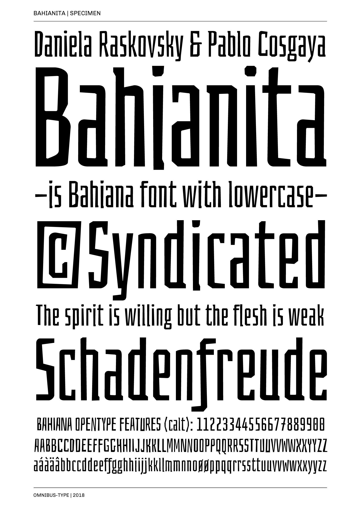

# Bahianita

**Omnibus-Type**  
*SIL Open Font License, 1.1*

Bahianita has rustic, fresh and casual look, as if carved in wood. Its structure is ideal for composing condensed titles and short texts. OpenType offers alternative glyphs and programming to avoid repeating equal uppercase or equal numbers. Bahianita offers 647 characters (1234 glyphs) and diacritics with support for over 103 Latin languages (including Guarani). Bahianita is a new free font from [Omnibus Type](http://omnibus-type.com/), designed by Daniela Raskovsky and Pablo Cosgaya. 

To contribute to the project contact [Omnibus Type](http://omnibus-type.com/).

### Designers

* Daniela Raskovsky
* Pablo Cosgaya

### License

Copyright (c) 2013-2015, Omnibus-Type (www.omnibus-type.com omnibus.type@gmail.com).

Licensed under the [*SIL Open Font License, 1.1*](http://scripts.sil.org/OFL); you may not use this file except in compliance with the License.

======
## FONTLOG for the Bahianita fonts

This file provides detailed information on the Bahianita font software.  
This information should be distributed along with the Bahianita fonts and any derivative works.

### Bahianita is a typeface family that supports Unicode language range: 

* Basic Latin 				  U+0020-U+007E
* Latin-1 Supplement 		U+00A0-U+00FF
* Latin Extended-A 			U+0100-U+017F

**Character map to support MS Codepages:**
* 1252 Latin-1
* 1250 Latin-2 (Easter Europe)
* 1254 Turkish
* 1257 Windows Baltic
* Mac Roman

*To contribute to the project contact Omnibus-Type at omnibus.type@gmail.com*

**01 May 2018 Bahianita v1,007**
- Updated underline
– Expanded set to GF_Latin plus

### Acknowledgements

If you make modifications be sure to add your name (N), email (E), web-address
(if you have one) (W) and description (D). This list is in alphabetical order.

**N:** **Daniela Raskovsky**  
**E:** omnibus.type@gmail.com  
**W:** http://www.omnibus-type.com  
**D:** Designer

**N:** **Pablo Cosgaya**  
**E:** omnibus.type@gmail.com  
**W:** http://www.omnibus-type.com  
**D:** Designer

**N:** **Nicolas Silva**  
**E:** omnibus.type@gmail.com  
**W:** http://www.omnibus-type.com  
**D:** Typeface development

**N:** **Yorlmar Campos**  
**E:** omnibus.type@gmail.com  
**W:** http://www.omnibus-type.com  
**D:** Typeface development  

**N:** **Oscar Guerrero Cañizares**
**E:** omnibus.type@gmail.com  
**W:** http://www.omnibus-type.com  
**D:** Typeface development  

