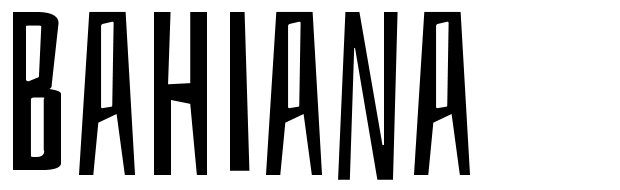

# Bahiana

**Omnibus-Type**  
*SIL Open Font License, 1.1*

Bahiana has rustic, fresh and casual look, as if carved in wood. Its structure is ideal for composing condensed titles and short texts. All signs are uppercase, but has OpenType offers alternative glyphs and programming to avoid repeating equal uppercase or equal numbers. Bahiana offers 490 glyphs and diacritics with support for over 103 Latin languages (including Guarani). Bahiana is a new free font from [Omnibus Type](http://omnibus-type.com/), designed by Daniela Raskovsky and Pablo Cosgaya. 

To contribute to the project contact [Omnibus Type](http://omnibus-type.com/).

### Designers

* Daniela Raskovsky
* Pablo Cosgaya

### License

Copyright (c) 2013-2014, Omnibus-Type (www.omnibus-type.com omnibus.type@gmail.com) with Reserved Font Name 'Bahiana'.

Licensed under the [*SIL Open Font License, 1.1*](http://scripts.sil.org/OFL); you may not use this file except in compliance with the License.

======
## FONTLOG for the Bahiana fonts

This file provides detailed information on the Bahiana and Bahiana One font software.  
This information should be distributed along with the Bahiana fonts and any derivative works.

### Bahiana is a typeface family that supports Unicode language range: 

* Basic Latin 				  U+0020-U+007E
* Latin-1 Supplement 		U+00A0-U+00FF
* Latin Extended-A 			U+0100-U+017F

**Character map to support MS Codepages:**
* 1252 Latin-1
* 1250 Latin-2 (Easter Europe)
* 1254 Turkish
* 1257 Windows Baltic
* Mac Roman

*To contribute to the project contact Omnibus-Type at omnibus.type@gmail.com*

**26 Dec 2013 (Nicolas Silva) Bahiana v.1.2**
- Encoding support:
  - Adobe Latin 3
- Improved TTF hint (TTFAutohint 0.97)

**8 jun 2013 (Omnibus-Type) Bahiana v.1.1**
- Initial release under SIL Open Font License, this release supports the following:  

Block              | Range
-------------------|--------------
Basic Latin        | U+0020-U+007E
Latin-1 Supplement | U+00A0-U+00FF
Latin Extended-A   | U+0100-U+017F

- Character map to support MS Codepages:  
  - 1252 Latin-1
  - 1250 Latin-2 (Easter Europe)
  - 1254 Turkish
  - 1257 Windows Baltic
  - Mac Roman
- Features in OT Tables:
  - GSUB:
    * **aalt** Access All Alternatives
    * **locl** Localized Forms
    * **sups** SuperScript
    * **frac** Diagonal Fractions
    * **ordn** Ordinals
    * **calt** Contextual Alternatives
    * **liga** Standar Ligatures
    * **ss01** Style Set 1
    * **salt** Stylistic Alternatives
      * Single Substitution
      * Ligature Substitution
  - GPOS:
    * **cpsp** Capital Spacing

### Acknowledgements

If you make modifications be sure to add your name (N), email (E), web-address
(if you have one) (W) and description (D). This list is in alphabetical order.

**N:** **Daniela Raskovsky**  
**E:** omnibus.type@gmail.com  
**W:** http://www.omnibus-type.com  
**D:** Designer

**N:** **Pablo Cosgaya**  
**E:** omnibus.type@gmail.com  
**W:** http://www.omnibus-type.com  
**D:** Designer

**N:** **Nicolas Silva**  
**E:** omnibus.type@gmail.com  
**W:** http://www.omnibus-type.com  
**D:** Typeface development  

